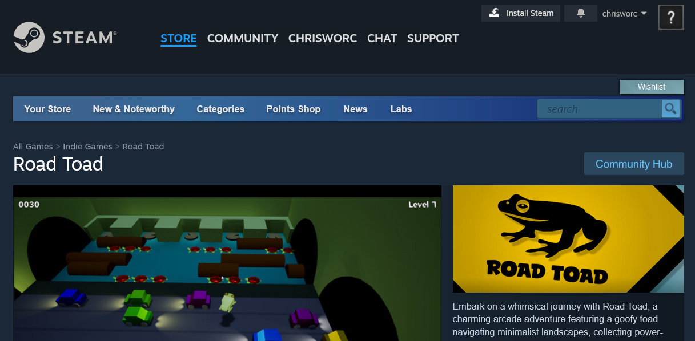
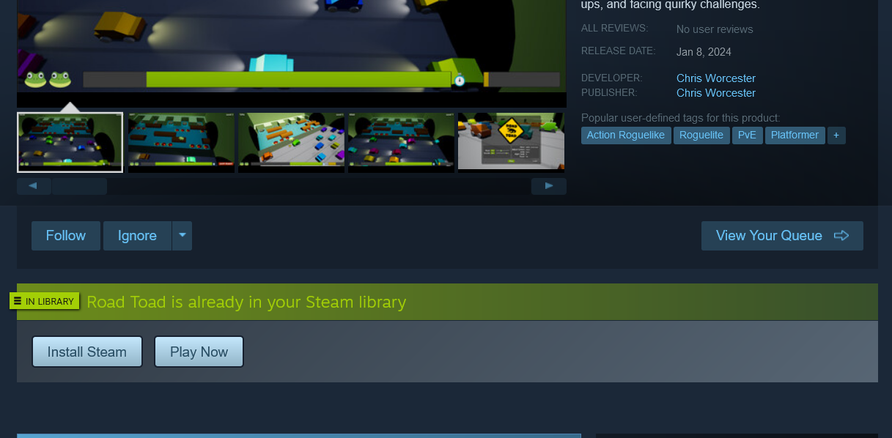
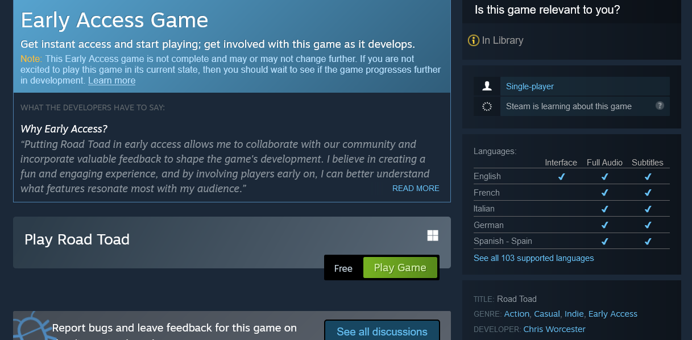
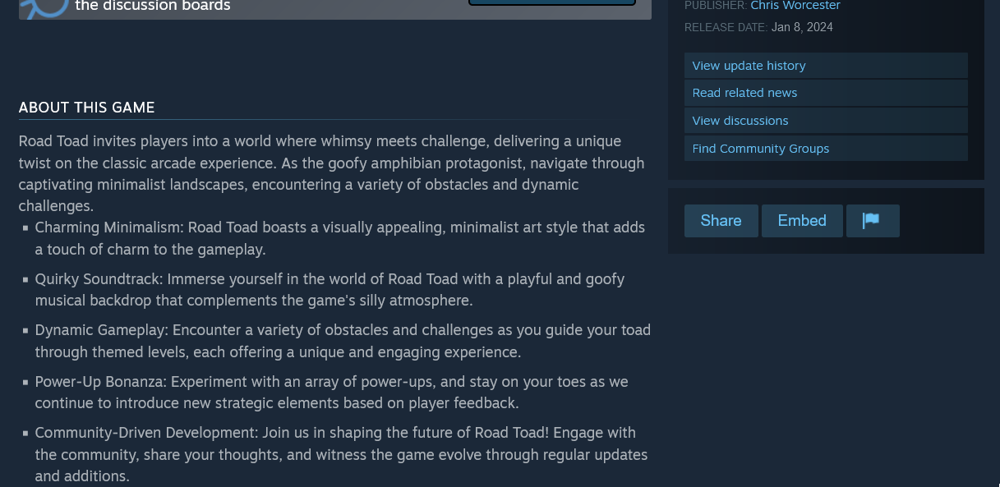

# Road Toad 🐸

Step into the world of Road Toad, a whimsical adventure built in Unreal Engine. Join our goofy toad protagonist as you navigate through captivating minimalist landscapes, collecting power-ups, and facing quirky challenges. Road Toad adds a recharging jump mechanic and a dynamic 3D perspective to the classic arcade experience.

## Play Now

Play the WebGL pre-alpha prototype [here](chriswhisker.github.io/road-toad-webgl/).

## Features

Road Toad offers a visually appealing, minimalist art style that adds charm to the gameplay, accompanied by a playful and goofy musical backdrop that complements the game's silly atmosphere. Navigate through themed levels, encountering a variety of obstacles and challenges, while experimenting with an array of power-ups in this community-driven development. Join us in shaping the future of Road Toad by engaging with the community, sharing your thoughts, and witnessing the game evolve through regular updates and additions.

## Steam Early Access

Embark on a whimsical journey with Road Toad through our Early Access on Steam, a collaborative phase allowing us to shape the game's development based on valuable community feedback. The duration of this Early Access phase is flexible, depending on feedback, suggestions, and the game's evolution. Our development focus includes introducing a diverse array of new power-ups and procedurally generated themed levels for added excitement and variety. We are committed to refining gameplay mechanics, enhancing visual and auditory elements for a more immersive experience, and actively incorporating player suggestions to resonate with our community. Additionally, we aim to optimize the user interface for a streamlined and user-friendly experience in the full version, while also considering whimsical additions like strapping a gun to the toad's head.

The essential mechanics of the game, including toad navigation and obstacle avoidance, are implemented and functional. A set of initial power-ups is available, providing players with strategic choices and adding variety to the gameplay.

## Future Plans

Once Early Access is completed, Road Toad will be offered at an affordable price, ranging from 1 to 5 dollars or slightly more, depending on the complexity of the game and the number of features added. We are actively involving the community by encouraging player feedback, suggestions, and ideas during Early Access to ensure a collaborative and player-driven development process for Road Toad.

## Steam Preview

Check out this preview of the Steam page.

